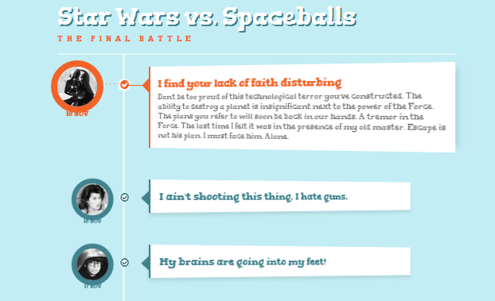

# 3D timeline design

This tutorial will tell you how to create timeline with a 3D effect. The idea is to expand a content area when the associated radio input is selected.
Use a radio input trick to create this fun css only timeline like structure. The main concept show a teaser of an item and when clicking on the associated radio input, the content will expand and rotate in 3D, giving some depth to the whole thing. We’ll be using CSS 3D transform, transitions and sibling selectors

<a href="http://www.tricksway.com/3d-timeline-design-with-css/"> http://www.tricksway.com/3d-timeline-design-with-css/ </a>
